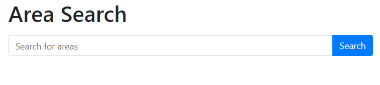
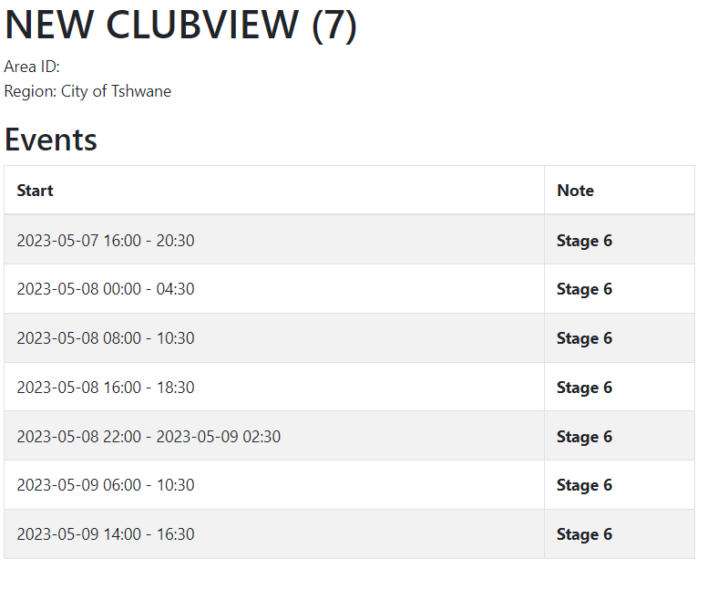

# Django App to get loadshedding information.

The project was created in Python 3.11.0 and Django 4.2.1

## Functionality

The App currently has two functions. 
1. search area (http://127.0.0.1:8000/search/)
2. Display loadshedding schedule for your area

## Requirements
All the requirements are in the requirements.txt file. 

For the api to work one must create a token.txt file in the root directory and add the token to it.

To get a token you should register at. https://eskomsepush.gumroad.com/l/api

Take note that the free API is limited to 50 requests per day.

## Example
### First Screen

### Third Screen

